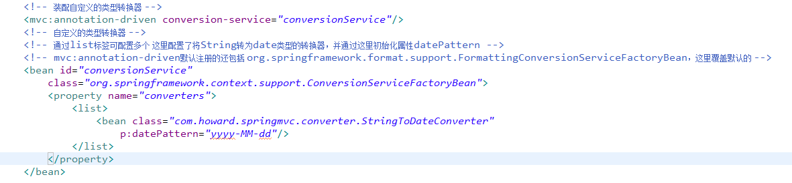
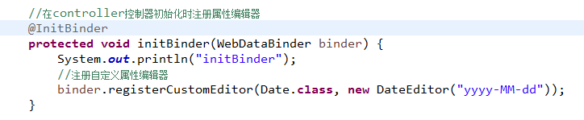
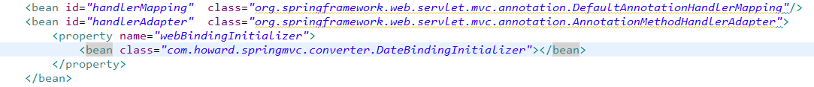

<h3>Springmvc有三种方式可以实现类型转换</h3> 
这里先说明一件事,在常见的springmvc中的一个配置："< mvc annotation-driven />"，该配置可以简化springmvc的配置。
但如果我们有时候需要自定义一些配置，所以还是必须了解下这句话到底帮我们做了什么，这里简单提几个：默认注册了几个必须的bean，其中包括：
mvc:annotation-driven、RequestAnnotationHandlerMapping(默认是DefaultAnnotationHandlerMapping)、RequestMethodHandlerAdapter(默认是AnnotationMethodHandlerAdapter) 
<h5>1、使用ConverterService</h5>
在springmvc中添加配置： 

 
访问路径：http://localhost:8080/springmvc/index和http://localhost:8080/converter1/register进行测试 
<h5>2、使用@InitBinder添加自定义编辑器转换数据</h5>
该方式使用java.beans的PropertyEditor 
注释掉方法1中添加的配置，然后新建一个类： 

com.howard.springmvc.converter.DateEditor 

在controller中添加方法，并加上注解@InitBinder，则该注解会在控制器初始化时注册属性编辑器，WebDataBinder用于请求消息和处理方法的绑定工作。 
 
但该方式只对当前controller生效。若要配置成全局生效的，可以参考方法3
<h5>3、使用WebBindingInitializer注册全局自定义编辑器转换数据</h5>
新建一个属性转化器：通过实现WebBindingInitializer接口实现： 

com.howard.springmvc.converter.DateBindingInitializer 
注释掉原先的： < mvc:annotation-driven/ >
修改如下： 

 

<h3>多种类型一起出现时的优先级顺序(springmvc按照以下的顺序进行查询相应的转化类)</h3>
1、查询通过@InitBinder装配的自定义编辑器 
2、查询通过ConverterService装配的自定义转换器 
3、查询通过WebBindingInitializer接口装配的全局自定义编辑器 