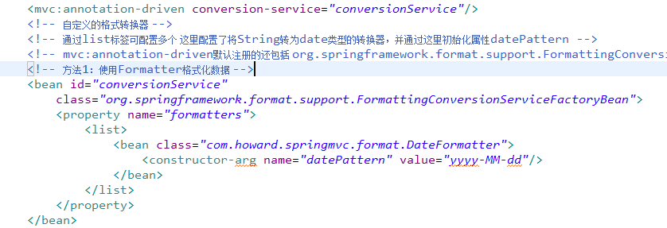
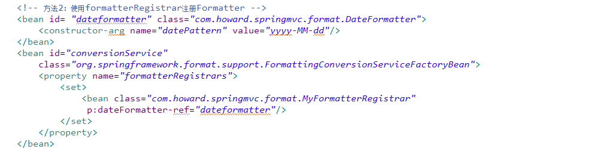

<h4>Converter完成Object到Object之间的转换，而Format类似PorpertyEditor，用于进行对象的解析和格式化</h4> 
Format格式化是spring通用的，主要有几种方式： 
1、使用Formatter格式化。 
主要是继承Formatter方法并重写print和parse方法 

 
2、使用formatterRegistrar注册Formatter 
这时候的配置应该改为： 

 
实际上spring的format包里提供了很多常见的数据格式转换类了。 
3、使用注解方式格式化。 
详情见类com.howard.springmvc.vo.FormatUser 
这里由于对< mvc:annotation-driven / > 到底帮我们注册了哪些bean还不是很清楚，导致这里我还是需要把< mvc:annotation-driven / >注释打开，去掉其他覆盖他的配置。 
为了结果看的明显，这里的页面jsp借助了标签form 